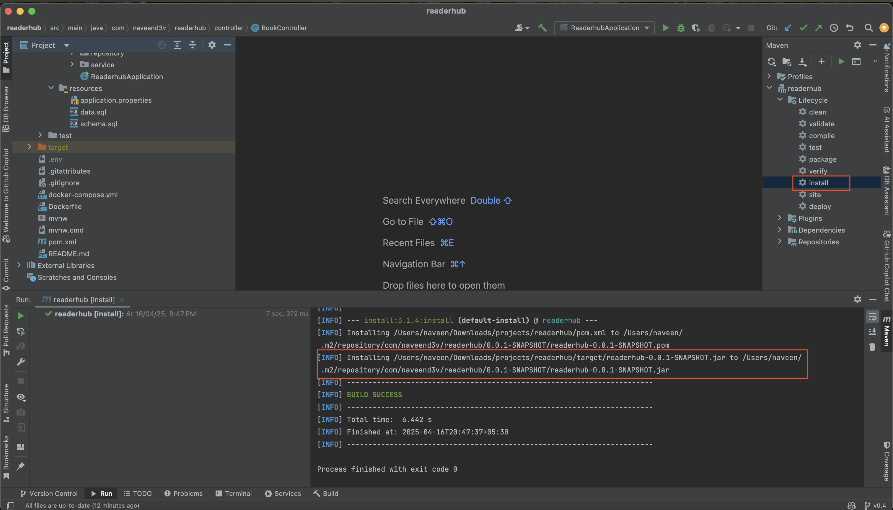
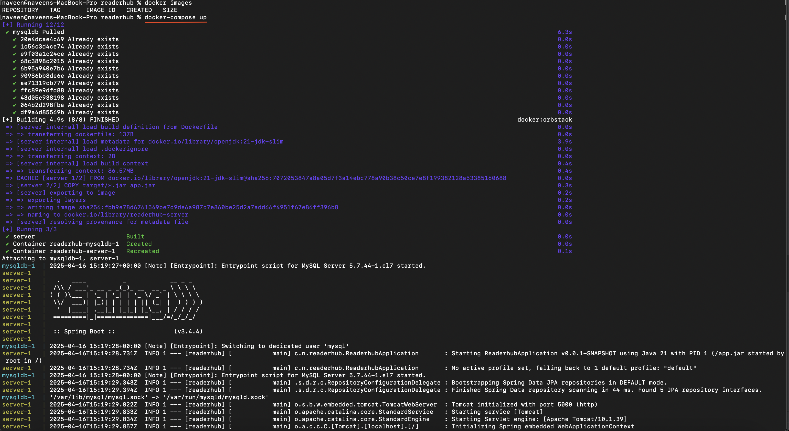
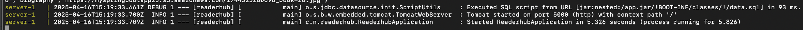
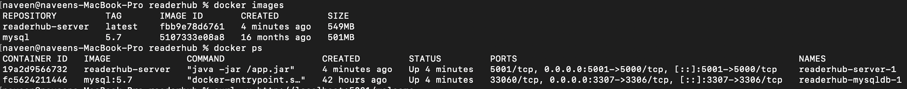
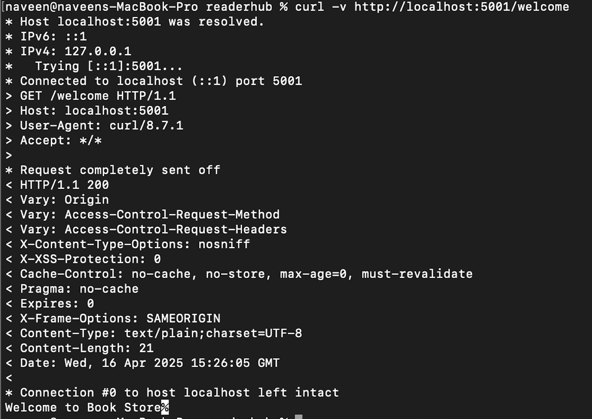

# Readerhub

## Overview

Readerhub is an online book store, where user can buy books. The owner of the store can add / delete / update books from online administrator webpage. This Backend of this project is build with Java SpringBoot framework with MySQL database and Front-end was build with Html, CSS(Bootstrap), ReactJs.

## Features
- JWT Based Authentication to access resources
- Storing books cover image to S3 bucket
- Payment Gateway Integration with Stripe
- Form Validation in Front-end and Back-end
- Back-end deployment with Docker
- Sample data initialization into MySQL DB using SQL scripts
- DataBase Relational data Handling with many-to-many relation
- Exception Handling with try and catch

## Prerequisites
- [OpenJDK 21](https://www.oracle.com/in/java/technologies/downloads/)
- [SpringBoot v3.4.4](https://docs.spring.io/spring-boot/installing.html)
- [AWS IAM Account Access Key and Secret key with read/write access to S3 bucket](https://repost.aws/questions/QUDgQ7bJn0Q8Ck7lt8gFrIeQ/need-to-create-an-iam-user-with-access-to-s3-and-aws-cli)
- [AWS S3 Bucket with public read only access](https://docs.aws.amazon.com/AmazonS3/latest/userguide/WebsiteAccessPermissionsReqd.html)
- [Stripe publishable and secret access keys](https://docs.stripe.com/keys)
- [Docker](https://www.docker.com/products/docker-desktop/)

## Project Flow
```
Administrator --> Admin login into Admin page
                  -> Add new books
                  -> Update existing book details
                  -> Delete books  
         User --> User login into book store login page
                  -> View all books from dashboard
                  -> Read book details like description, authors etc
                  -> Add books to cart
                  -> Order books from cart through stripe
                  -> View order history
```
## Usage
1. Clone this repo:
    ```
   git clone https://github.com/naveend3v/readerhub.git
    ```

2. Configure below environment variables in ```.env``` file
   - ```AWS_ACCESS_KEY_ID``` - Set your AWS IAM user access key id
   - ```AWS_SECRET_ACCESS_KEY``` - Set your AWS IAM user secret access key
   - ```AWS_S3_BUCKET_REGION``` - Set your AWS S3 bucket located region
   - ```AWS_S3_BUCKET_NAME``` - Set your AWS S3 bucket name
   - ```STRIPE_SECRET_KEY``` - Set your Stripe account secret key

3. In IDE, run ```maven clean install``` command to create ```.jar``` file or use IDE to generate ```.jar``` file.

   

4. Running via docker: 
   - Open terminal in project root folder
   - Execute command: ```docker-compose up```

     

   - Wait for few minutes, docker pull the required images, build and spin the MySQL and SpringBoot containers

     

   - Check the docker containers are up and running using commands ```docker images``` and ```docker ps```

     
   
   - Then you can check the connection with the curl command in host terminal / postman.

     

## Front-end code
 - Github repo - https://github.com/naveend3v/readerhub-frontend